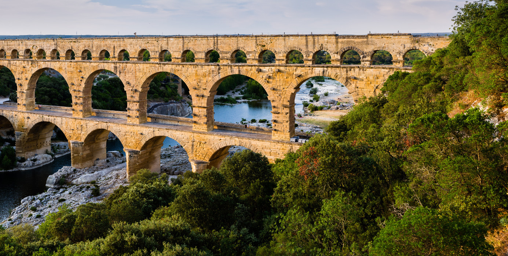
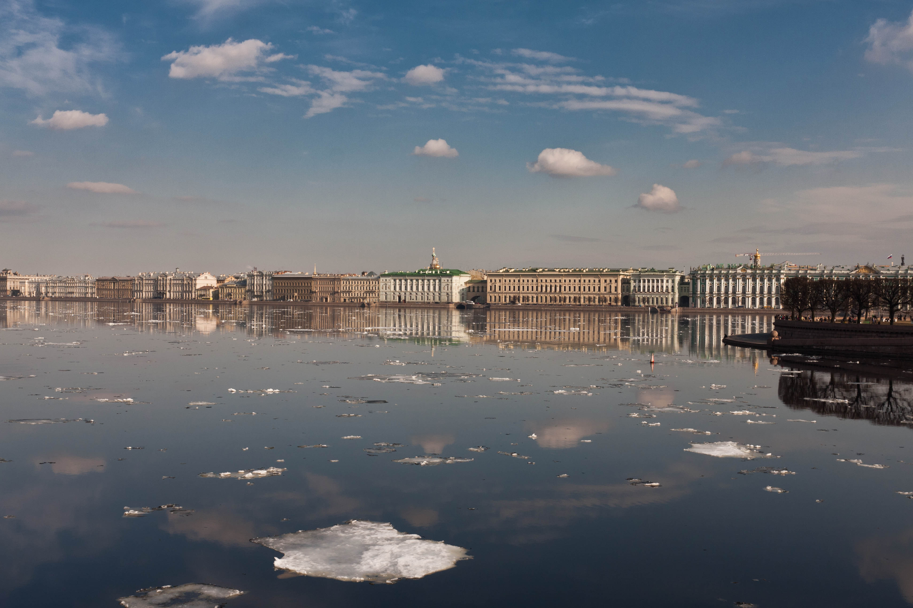

# image-stitching
Image stitcher using cv2.  
I am working on a version more mathematicaly based where it is easier to see how every step works.  
Libraries required:  
- Numpy
- OpenCV

# How does image stitching works?
- **Step 1:**
Load images.
- **Step 2:** 
Detect the keypoints in every image. This keypoints can be detected using methods such Harris or Hessian interest point detectors.
- **Step 3:** 
Compute the descriptors. Most common method is Scale-Invariant Feature Transform (SIFT).
- **Step 4:** 
Find most similar points between contiguous images. 

Once we have finished this four steps, the next steps are included in the process called RANSAC.
- **Step 5:** 
Pick a random number of similar pairs of points.
- **Step 6:**  
Compute the homography. This step will make our images have the same perspective.
- **Step 7:** 
Compute the homography distance in order to get the best homography that will make our images have the most similar perspective.  

When the RANSAC process is ended, there is only one step missing.
- **Step 8:**  
Warp images using the best homography.

# Files
## using_cv2.py
In this file images are stitching using OpenCV API. 3 functions are given:
- stitch:  
This function does the entire stitching process and returns the wrapper image. Uses ORB to detect keypoints and compute descriptors and BFMatcher to find most similar points.
The RANSAC process is intrinsic in the findHomography function. The last part in this function warps both images in one.
- check_side:  
This function finds which image is on the left side. This asserts the order of the images using stitch function.
- multi_stitch:  
If there are more than two images to be stitched together, this function warps them together.

## utils.py
Contains helper functions such as image rescaling, background cropping, etc.

## run.py
Change the IMAGE_NAME variable to another keyword that appears in the same group of images. The final image will be stored in a the folder output with the name of the keyword as *.jpg*.

# Examples
This examples are made using OpenCV test images. Find them in [this OpenCV github repository](https://github.com/opencv/opencv_extra/tree/master/testdata/stitching).

Also included some examples using [this project](http://web.cecs.pdx.edu/~fliu/project/stitch/index.htm) images.
## Bridge
The first example is a bridge. This one is the easiest one and we can see here the original images.  

&nbsp;&nbsp;&nbsp;
  
     
In the final image, we can see it is difficult to find where the image was wrapped.  

     
## Church
In this example we can find 3 pictures made with the same point of view. One of this images has color.  

 
     
The final image is quite good eventho we can appreciate deformation on right image and a black edge.  

     
## Newspaper
Cover page from a newspaper divided in 4 images.  
 
 
 
   
     
We can notice how the upper part is a little bit deformed and some white cuts in the middle of the image.
 
     
## Boat
This image is composed by 6 images.  

  

  
     
 In this example we find that using 6 image, some portion on the right side is missing and we can appreciate a huge deformation. 
 

# Church panorama
This image uses 2 images with a different point of view with a chuch as interesting point.  

  
     
The final output is a disaster and the algorithm was not able to stitch both images properly.
 
